# Assignment 1: Heuristic Evaluation

Rachel Liu | DH-110 | Fall 2022

## Tentative Title: Building Sustainability Through Competition

### About the project

Building sustainable communities is arguably one of the most important initiatives to ensure our future success. Unfortunately, the path to sustainability is shrouded in mystery and blocked by seemingly unattainable goals. If we truly want to value sustainability, we must begin by educating and engaging our youth. This project aims to make sustainable living accessible by creating a space where students can compete against others in exciting challenges for coveted prizes. This mobile application will not only equip the next generation of city-builders with knowledge on how to build a sustainable city but will generate a community of like-minded people as well. 

### Jakob Nielson's [10 Usability Heuristics](https://www.nngroup.com/articles/ten-usability-heuristics/) Explained

| Number | Heuristic | Description |
|---|---|---|
| 1 | Visibility of System Status | Users should always be informed regarding the status of the app |
| 2 | Match Between System and the Real World | Users should be able to intuitively use the app as if completing a real-life task |
| 3 | User Control and Freedom | Users should be provided an easy way out |
| 4 | Consistency and Standards | Users should experience similar situations similarly |
| 5 | Error Prevention | Users should not experience conditions in which errors are prone to occur |
| 6 | Recognition Rather Than Recall | Users should not have difficulty retrieving relevant information |
| 7 | Flexibility and Efficiency of Use | Provide multiple ways to perform a task to make the platform accessible to all users |
| 8 | Aesthetic and Minimalist Design | Users should not experience visual elements that distract them from their task |
| 9 | Help Users Recognize, Diagnose, and Recover From Errors | Users should understand what went wrong if an error occurs |
| 10 | Help and Documentation | Users should be able to find and recieve help if needed |

### [Severity Ratings](https://www.nngroup.com/articles/how-to-rate-the-severity-of-usability-problems/) for Usability Problems by Nielsen Norman Group

The following rating scale was used to evaluate severity of usability issues:
| Rating | Description |
|---|---|
| 1 | Cosmetic problem only: need not be fixed unless extra time is available on project |
| 2 | Minor usability problem: fixing this should be given low priority |
| 3 | Major usability problem: important to fix, so should be given high priority |

Ratings are displayed in parentheses after each usability issue.

## Application 1: [Earth Rewards](https://play.google.com/store/apps/details?id=net.earthrewards.app&hl=en_US&gl=US)

  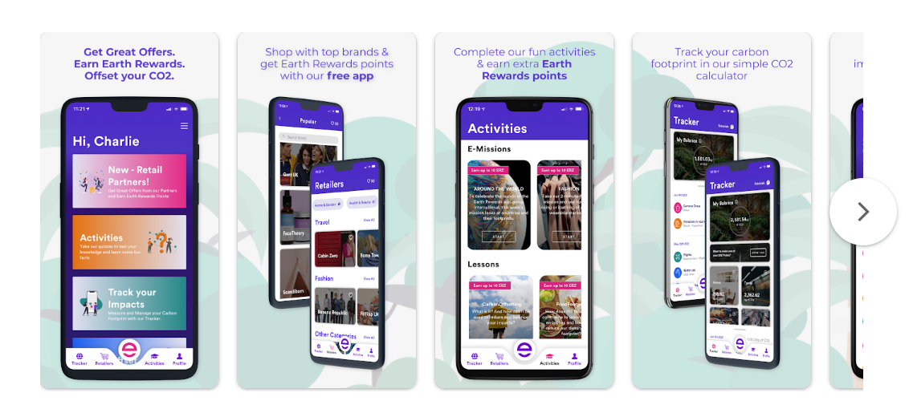

### About
[Earth Rewards](https://play.google.com/store/apps/details?id=net.earthrewards.app&hl=en_US&gl=US) is a carbon footprint calculator application that encourages purchases from listed retailers to offset users' own carbon footprint. This app claims to make it easy to "start living a more eco-friendly and sustainable lifestyle," according to the description on their Google Play download page. Although I do not align with the intentions of this app, as it is inherently for-profit, I believe the point system is a similar structure to the one I had in mind for my final project. 

My goal with the provided recommendations is to not necessarily alter the intentions of this application, but to minimize the learning curve needed for users to absorb content.

<i> Note: The application must be downloaded to compare comments listed below to page-specific UI/UX. For ease, I have included screenshots where possible. </i> 

### Heuristic Evaluation

#### 1. Visibility of System Status
* Within the "My balance" section, the “Transaction is being processed…” notification is not automatically updated when complete. It is up to the user to reload the page to see any changes in status.  (1)

* Similarly, within the "Retailers" section, the response from marking a store as “favorited” is not immediate and may lead to rapid, frustrated clicking from the user. (1)

> *Recommendation: Display continuous and immediate updates so users are always aware of current app status. Within the "My balance" section, this means automatic updating the page before users feel the need to manually reload. On the other hand, on the "Retailers" page, speed up feedback time in response to clicking the heart.*

* The structure of the app is not clear. Besides the home page, each individual section has no visible tie back to the previous. (3)

> *Recommendation: Create a more effective menu bar by optimizing use of icons, decreasing menu size, and apply it to all pages possible so users are always aware of their location in the application.*

#### 2. Match Between System and the Real World
* There is an overload of jargon and various metrics on the page with no simple method to understand them. Within one section, vocabulary includes “Blockchain,” “Offset CO2,” “Pre-Populated Offsets,” “Custom Offset,” “Quick Offsets,” and “Personal Offsets.” Metrics include “Kg of CO2,” “pints,” “Liters,” “dollars,” “points,” E-missions,” “Lessons,” “Impacts,” and “Earth Rewards.” The feeling of overwhelmingness is immediate and obvious. (3)

  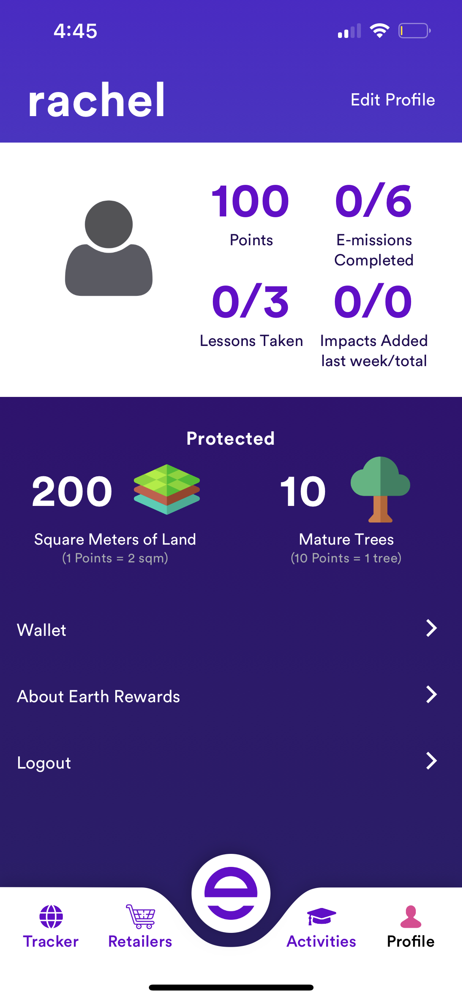
  

> *Recommendation: Decrease vocabulary to increase learnability. For example, establish one obvious point system, such as "Earth Rewards", and stick with it. For example, Khan Academy (energy points) and Reddit (Reddit karma) are websites/webapps which have found success in using a single point system.*

#### 3. User Control and Freedom
* When accidental pop-ups occur, a user's automatic and intuitive action is to click outside of the popup to quickly remove themselves from the situation. Unfortunately, in this app, clicking on the darkened area around the pop-up does nothing but cause frustration. (1)

> *Recommendation: Provide users with an easy emergency exit by making the darkened area around the pop-up a clickable area to exit. *

#### 4. Consistency and Standards
* There are a few small standardization issues within the app. Firstly, clicking the “x” on the right side of a search bar typically clears existing text within the search space. In this app, that “x” exits the user out of the search area and collapses the keyboard. Secondly, it is standard to expect that clicking on a user's profile picture allows them to change it. Thirdly, clicking a section icon more than once typically scrolls users up to the top of a section. This app does not fulfill any of the mentioned expectations.(2)

> *Recommendation: There exists quite a few instances within the app where users expect outcomes that are not received. First, re-establish functionality to the status-quo by allowing the “x” on the search bar to clear the text in the search space. Second, make the profile picture clickable along with a popup which allows quick profile photo changes. Thirdly, automatically route users to the top of the page, along with an automatic reload when the section icon is clicked.*

* The white space between a menu item and the edge of the phone differs between pages and seemingly at random. (2)

  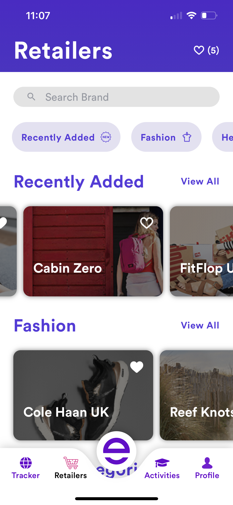
  

> *Recommendation: Design with visual consistency. All pages should have the same or similar formats, colors, and feel. This will increase trust in the product.*

#### 5. Error Prevention
* In the “Lessons” section, users can learn about how certain actions contribute to sustainability. Yet it is easy to accidentally swipe out of a lesson and lose progress. (2)

  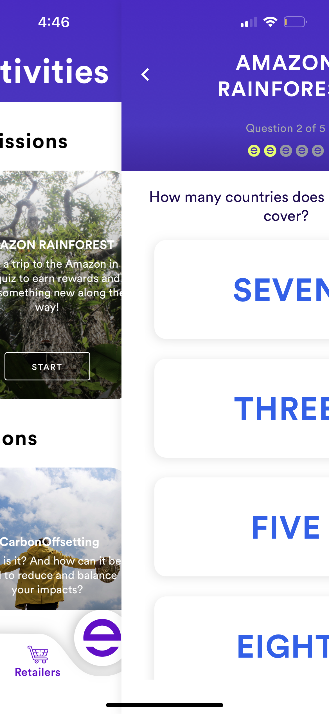

> *Recommendation: Despite providing users with a mark that represents progress, users are not able to swipe left of right to continue forwards/backwards with the lesson. Enable users to use the swipe function when swiping in the middle of the page, and allow them to swipe out (with a warning pop up that progress will be lost) only when doing a full swipe from the edge of the page.*
  
* While clicking around the app it is easy for users to accidentally click the “Log out” button. Without warning, Users are automatically logged out of their account. Being forced to go through the whole sign in process again is an immediate deterrent and drop-off point. (2) 

> *Recommendation: Provide pop up messages which warn users about outcomes of a possible accidetal action and provides an option to return to the application. This is important because repetitive log-in processes are cumbersome and frustrating.*

#### 6. Recognition Rather Than Recall
* The Search function acts more like a filter rather than an actual search function. Storefront icons dissapear as letters are typed but it is not obvious what stores are still available. (1)

  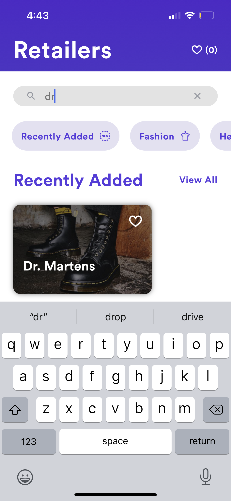

> *Recommendation: As a user types into the search bar, recommend stores in a clickable dropdown menu underneath.*

#### 7. Flexibility and Efficiency of Use
* The app is static and unchanging. Assuming a user has fulfilled the lengthy learning curve in order to learn how to use this app, there are no options for customization if it is wanted or needed (1)

  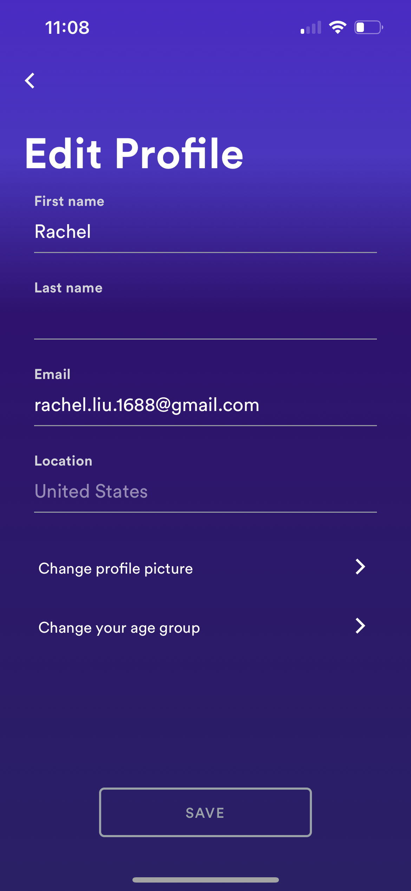

> *Recommendation: In addition to currently existing sections in the "Edit Profile" section, create a section for customization and accessibility where users can toggle options on and off.*

#### 8. Aesthetic and Minimalist Design
* Icons used in the “Offset” section are designed with a variety of unnecessary colors. At first glance, it seems as if the colors contribute to the categorization of the items on the page, but further scrutiny shows it does not. (2)

  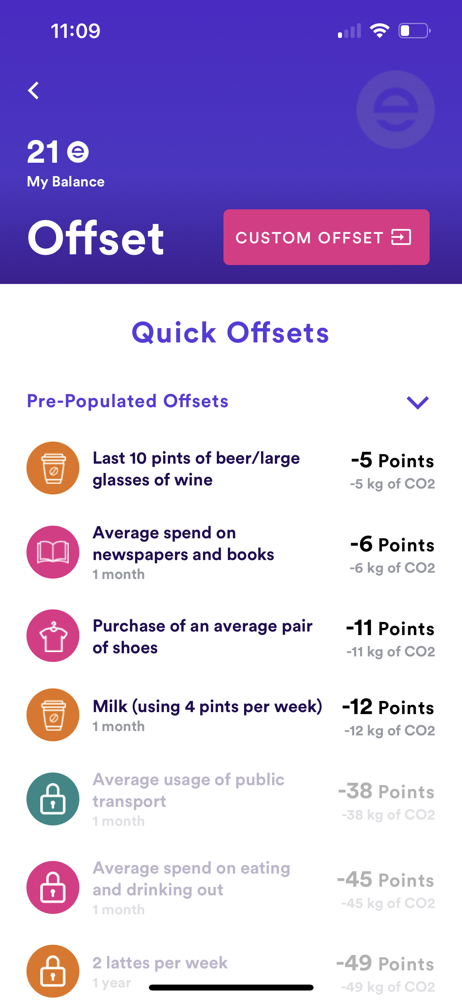

> *Recommendation: Refine the theme of the app to a smaller list of icons and colors. Only use colors where necessary. For example, the list of icons should be one color.*

#### 9. Help Users Recognize, Diagnose, and Recover From Errors
* If a user is unable to log into their account using the menu options at the bottom of the screen, the error message that pops up is uninformative; simply stating “There was an error while trying to log you in.” (1)

  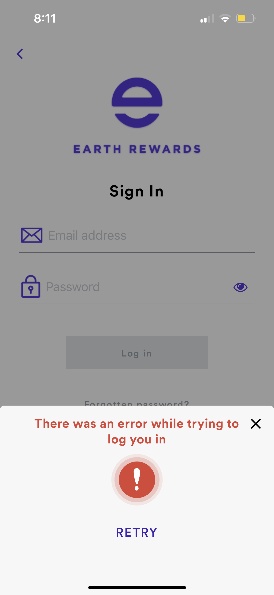

> *Recommendation: Provide users some direction in the error message by including a button which says “try a different log-in method.”*

#### 10. Help and Documentation
* The FAQ is short and difficult to access. If by chance your question is not available, there is no simple way to contact the creators. Every “get in touch here” hyperlink automatically routes users to Apple’s “Mail” app. If users happen to not be signed into that application, and no email address is actually listed, users may not ever get their questions answered. (2)

  

> *Recommendation: Provide live chat function to provide immediate help to users. If there is no budget or bandwidth to do so, state the company email at the top of the FAQ, hyperlinked if users prefer to click. *

### Overall Assessment

From an initial glance, the app looks aesthetic and professional. Stakeholders would not expect drop off to occur until the user begins interacting with the app, as they realize that quite an intense learning curve is required to consume content. Majority of the offered recommendations focus on improving the user experience, rather than interface design elements.   

## Application 2: [sustainability](https://play.google.com/store/apps/details?id=com.cleanbit.joulebug.pbj.bostonu&hl=en_US&gl=US)

  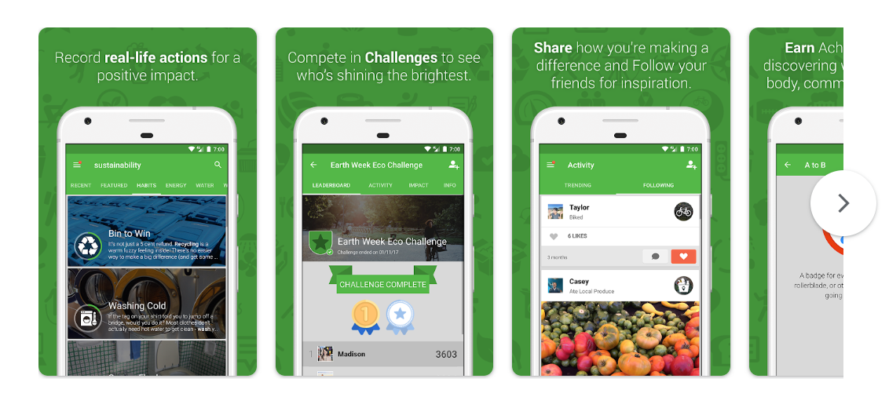

### About
[sustainability](https://play.google.com/store/apps/details?id=com.cleanbit.joulebug.pbj.bostonu&hl=en_US&gl=US) is an application created for use by Boston University students. The goal of the app is the make students' daily habits more sustainable, and creates a community in which students can post images of themselves taking part in the sustainability movement, while gaining points and awards to compete with friends. The app not only educates students about how each action makes a difference, but also builds a community.

Similar to the previous list of recommendations, my goal with this application is to minimize the learning curve needed for users to absorb content. Intentions are great but there are quite a few barriers users would hit before deciding to use this app frequently. 

<i> Note: The application must be downloaded to compare comments listed below to page-specific UI/UX. For ease, I have included screenshots where possible. </i> 

### Heuristic Evaluation

#### 1. Visibility of System Status
* Though each of the 5 sections at the bottom of the app, “Activity,” “Challenge,” “Buzz,” “Notifications,” and “Profile” are present no matter what internal page the users are on, there is no obvious landing page. (2)

  

> *Recommendation: Create an obvious landing page that users would want to spend most of their time on.*

#### 2. Match Between System and the Real World
* There is quite a lot of new jargon which are not well defined. Points, Buzzes, Actions, Badges, and Medals seems like quite a few metrics. Users may be unsure which one they are trying to increase. (3)

  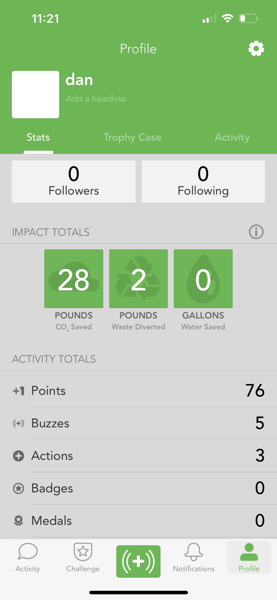

*Recommendation: Decrease the vocabulary for sake of an easier learning curve. Have a singular point system where users immediately know what they are attempting to increase.*

#### 3. User Control and Freedom
* Clicking the “Join Challenge” button threw users into a loading loop with no easy way to exit. Users will be forced to completely swipe out and reopen the app to remove themselves from the situation. (2)

> *Recommendation: Yes, errors and bugs happen, but a system should be in place so that the page “gives up,” displays to users an error message to try again later, and automatically moves them away from the buggy page.*

#### 4. Consistency and Standards
* It is typical for a full swipe left or right to undo or redo a page. Weirdly enough, this action is supported by only select pages on this application. (1)

> *Recommendation: This recommendation is annoying but necessary. Developers need to painstakingly check each page to make sure they all operate similarly. Provide users the option to swipe out of a page on every page*

#### 5. Error Prevention
* If users accidentally “Followed” a user they do not know, there exists no obvious method to unfollow.  
* If users accidentally posted a “Buzz” which acts a bit like a tweet, two main issues become evident, which are issues with findability and usability. Even after dedicating quite a bit of time to find the public tweet (as it did not show up in the “Trending” page), there exists no delete function once tweeted. What if a user had mistakenly written something offensive? (1)

  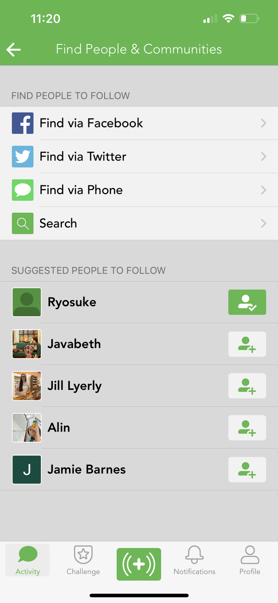  
  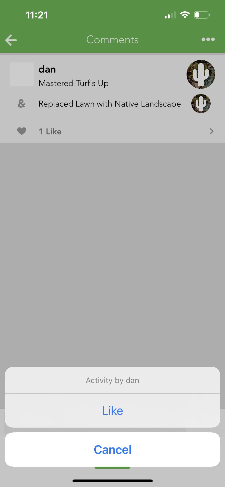

> *Recommendation: Though icons are relatively large and difficult to accidentally click, there may be actions users have immediately regretted and would like to reverse. By allowing a click to unfollow (like Instagram) and automatically routing users to the page which they can find their “Buzz” post immediately after posting, users will be able to quickly reverse errors.*

#### 6. Recognition Rather Than Recall
* Majority of users do not know nor remember how to achieve “Badges” or “Medals.” Users expect that clicking on these sections within their profile would bring them to actions that would earn them these items. (2)

> *Recommendation: Instead of expecting users to read through the FAQ to figure out how to fulfill the criteria to achieve the award, provide clickable greyed-out icons which pop-up a description and progress bar when touched.*

#### 7. Flexibility and Efficiency of Use
* There is no easy method to scroll up to the top of the feed. Users might expect that clicking on the “Activity” icon a couple of times would do the trick, but it does not. (1)

> *Recommendation: Since users are used to detailed functions in commonly used apps such as Instagram, it is recommended to link multiple clickings on a certain icon to bring users to the top of the feed, along with an automatic reload.*

#### 8. Aesthetics and Minimalist Design
* There are new icons and vocabulary for every activity. This is excessive and confusing and users would be unsure regarding the relevancy of any of these items. (2)

> *Recommendation: Decrease the amount of icons and vocabulary so learning curves are optmized and quick.*

#### 9. Help Users Recognize, Diagnose, and Recover From Errors
* Users may create a profile to test out the app experience with no intention to continue using the app. Unfortunatley, there currently exists no way to delete a user's account. This may generate fear regarding privacy and data collection. (3)

> *Recommendation: Allow for relatively easy deletion of an account (with relevant warnings, of course).*

#### 10. Help and Documentation
* The Help Center simply does not exist. When clicked, the page is blank and says “No articles found.” (3)

  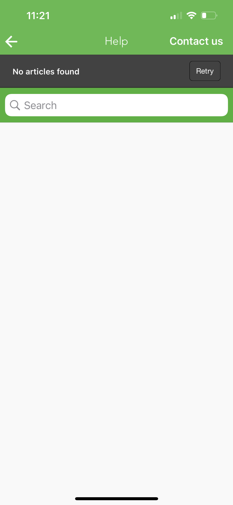

> *Recommendation: Keep all app pages up and running to establish customer trust.*

### Overall Assessment

Though the overall intention of the app is to create positive influences on sustanability within the BU campus, frustrations and confusions within the app may cause user drop-off which will decrease overall impact. By paying attention to details such as keeping all pages up and running, providing users control and flexibility, and simplifying the point system to shorten and flatten the learning curve, [sustainability's](https://play.google.com/store/apps/details?id=com.cleanbit.joulebug.pbj.bostonu&hl=en_US&gl=US) impact on the campus will surley increase. 
