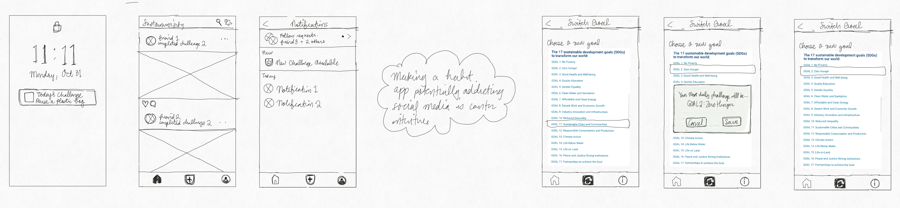

# Assignment 5: Low Fidelity Prototype

Rachel Liu | DH-110 | Fall 2022

## Description of project 

This project integrates daily sustainability challenges with a simple social media experience to inspire the target audience, undergraduate students at UCLA, to take small steps toward building a sustainable community. User research demonstrated a functional divide between web page and mobile app usage, and validated the need for a mobile app to serve the target audience. While web page searches on laptops were used as an initial jumping off point for users to discover sustainable development goals which they felt passionate towards, the journey typically ended there. There exists a critical need for the continuation of the user journey after the initial search stage, which is where this mobile application project, titled Sustainiversity, comes in. It is expected that once users discover and download this product after initial web searches, they will use this product daily. Due to the application’s simplicity, social aspects, and benefits in generating sustainable habits, users will collectively make massive impacts towards building a sustainable community.

In previous assignments, two personas spearheaded the creation of two features and accompanying tasks which fit their needs. The first persona was a young college student from the other side of the country and in desperate need of a sense of belonging. The other persona was a senior in college who wanted to integrate more structure and positive habits in his life before assimilating into the workforce. The features inspired by these personas were:

1. Challenges - Recommendations for exciting social on-campus traditions with a sustainable twist to encourage community building.
2. Habit Builder - Personalized action plan to integrate healthy sustainable habits into the user’s life (Different time investments: 5 minutes/day, 10 minutes/week, 1 hour/month)

After quite a few interactions prior to and after prototype testing, it was discovered that combining these two features into one “Daily Challenge” would provide a simpler, more intuitive user experience. The young college student persona would fulfill her need of a sense of belonging through the social aspect of the app, while the older, more mature persona would achieve his habit building need through the daily notification.

The purpose of low-fidelity prototyping is to optimize the user journey by analyzing a potential user’s interaction with content-based wireframes. These interactions are crucial representations of what users expect, want, and need to happen in response to clicking on certain icons. The mindset of the target audience, regardless of how contrasting it might be from the researcher, must be taken into consideration to successfully create an experience that feels intuitive to those who will use the application. Within this project, three main tasks were asked of the participants:

* Task 1: Log in to the app
* Task 2: Learn more about the sustainability goals 
* Task 3: Complete the Daily Challenge

Please Note: Task 3 is a combination of the two tasks previously mentioned in the Persona + Scenarios assignment. Further research illustrated that implementing two completely separate features may lead to a more difficult learning curve. 

## Wireframes
The following is a complete list of tasks that the (paper) prototype of my system supported:
1. Sign in through SSO
2. Learn more about the sustainability goals 
3. Complete the Daily Challenge and share an image to only friends. 
** The Daily Challenge could be completed through various pathways: 1) Notification banner on the phone lock or home screen, 2) The [+] button on the navigation bar, 3) Clicking on the “complete daily task to view photos” written above the blurred photos on the home page, or 4) Clicking on the “Today’s challenge: Reuse a Plastic bag” banner above the photos on the home page. 
4. View previously completed challenges 

  

## Wireflows

### Wireflow Iteration 1
All 4 tasks are included in the wireflow shown below. The blue lines demonstrate all possible interactions with the prototype: 
1. Sign in through SSO
2. Learn more about the sustainability goals 
3. Complete the Daily Challenge and share an image to only friends. 
4. View your previously completed challenges

  

Please Note: Improvements were made to this paper prototype. See [Wireflow Iteration 2](https://github.com/rachichi/DH110-22F/blob/main/Assignments/A05/Assignment05.md#wireflow-iteration-2) for an updated iteration.

### Wireflow Iteration 2
#### Improvements have been outlined below:
* Redesigned paper prototype in Figma
* Removed the “Build you Profile” page to stay consistent with the narrative that this user has previously existed. 
* Changed the (i) button to (?) on the navigation bar to make the purpose of the icon more obvious.
* Connected the question mark on the navigation bar directly to the “Learn More” page to improve intuitiveness.
* Build out what the help pages might look like within the app (does not link out externally).
* Removed the text under the “Profile” page which links externally to unep.org. This was not a good location for any links.  
* Removed the “Share On” button below the “View completed challenges” page to decrease confusion

  

## Testing the Wireflow

### The following list are the tasks that were requested of the user:
| Number | Task | Completed? |
|---|---|---|
| 1 | Pink: Log in to your profile.  | This task was successfully completed. |
| 2 | Green: Complete the daily challenge. | This task was successfully completed. |
| 3 | Blue: Learn more about the sustainability goals. | The tester landed on the correct page but clicked the wrong button to get there. |

  

[Iteration 1 Prototype Testing Screen Recording](https://drive.google.com/file/d/1Is2kHfBpWMimhcIWbwqSL1j3RIXk8THW/view?usp=sharing) (begin 01:20)

### Observations:
#### Before the walkthrough
* Overwhelmed by the amount of frames at first glance
* Wanted to know what the app was supposed to do
* During the walkthrough
* Began Task 1 from the notification page.
* Became confused when after seemingly creating a new profile, the logged-in user already had completed actions within the app.
* Paper prototype was a bit difficult to read. Participant had to stop and ask for clarification. 
* Did not enjoy “leaving” the app when completing Task 3. Felt that simple action made the app untrustworthy. 
* Expects to see the “Learn More” section include a mission statement and a story.
* Since flow was similar to that of BeReal, learning curve was minimal

  

## Reflection 

### Creating my prototype
The process of creating my low fidelity prototype was far from smooth and vastly different from my expectation but I gained quite a lot of knowledge. The greatest mistake I made in the beginning of the prototyping process was creating a paper prototype that was much too complicated and detailed. 
The first mistake was that because two features had come out of the previous assignment with the personas and scenarios, I was racking my brain to figure out how to visually incorporate these two very distinct areas into one cohesive app. The answer, I eventually accepted, was that this simply was not possible. I scraped the initial idea and instead, combined the two features into one to create the “Daily Challenge.” The young college student persona would fulfill her need of a sense of belonging through the social aspect of the app, while the older, more mature persona would achieve his habit building need through the daily notification.
The second mistakes were smaller. I had initially attempted to create a much more social, Instagram-like experience on the left to address the wants of the young undergraduate student persona, and also experimented with changing themes of the daily task according to the 17 sustainable development goals on the right. Both these wireframes are included below and were not used into the final interactions, but instead a demonstration of growth. 

  

### Testing my prototype
Luckily, the process of testing my prototype went much smoother than the process of creating my prototype. 
Previously, the participants of my research in Assignments 1-4 were other members of the class or were at least relatively aware of the user research process. This assignment was the first time where I worked with a participant who had no prior knowledge of User Research and was going into this walkthrough practically blind. Due to this major difference, I had to explain in depth the purpose of the mobile application, the study, and answer more questions prior conducting the research.
However, regardless of this difference, I did feel like the wireflow testing process went relatively smoothly. My participant had quite a few frames to interact with and she really enjoyed the process. Even though she had no idea what user research entailed, the feedback she provided was extremely helpful in my process to create a second iteration of the wireframe/wireflow. 

### What would I change?
I ended up acting on the feedback I received from prototype testing, with the written and visual results split between the observation section of Testing the wireflow and Wireflow Version 2. I have included a more cohesive list of problem and solution below: 

#### To improve the experience of the tester:
| Number | Problem | Solution |
|---|---|---|
| 1 | The tester was overwhelmed by the amount of frames handed to her at first glance. | In the future I will provide some background into the purpose of prototype testing and reinforce the fact that the tester is not being tested to decrease nervousness. |
| 2 | The tester felt “thrown into the deep end” as she did not understand what the mobile application was supposed to accomplish, even when requested to complete specific tasks. | In the future I would prepare a short blurb about the basic purpose of the app. |
| 3 | The tester was confused by the inconsistency of the narrative of the hypothetical user between tasks.  | In the future I would prepare scenarios to provide context to the requested tasks especially when the wireframes used during the tasks are not necessarily related (Example: Hypothetical new user versus hypothetical old user). For the sake of this wireflow, though, I removed the “Build you Profile” page to stay consistent with the narrative that this user has previously existed.  |

#### To improve the prototype:
| Number | Problem | Solution |
|---|---|---|
| 1 | The tester felt that the handwritten paper prototype was a bit difficult to read. She ended up having to stop and ask for clarification. | I redesigned the paper prototype in Figma and changed unneeded text to redacted font. |
| 2 | The user did not enjoy the hypothetical experience of leaving the app when completing Task 2. She felt that leaving the app to find more information about how to use the app was an untrustworthy sign. Also, after clicking into the (?) button, the tester expected to see the “Learn More” section include a mission statement and a story. | I built out what the help pages might look like within the app (does not link out externally). |
| 3 | The user struggled to find the link to more information and ended up clicking one of the “Share On” buttons to take her to the more information page. | I removed the text under the “Profile” page which links externally to unep.org. This was not a good location for any links. I removed the “Share On” button below the “View completed challenges” page to decrease confusion. I changed the (i) button to (?) on the navigation bar to make the purpose of the icon more obvious. I connected the question mark on the navigation bar directly to the “Learn More” page to improve intuitiveness. |

Overall, I learned a great deal from this experience and feel prepared for any future wireframing endeavors! 
