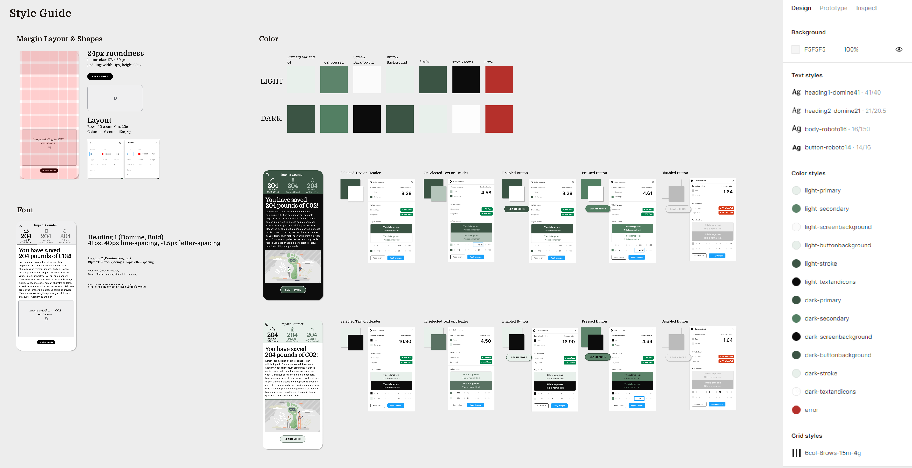

# Assignment 6: Interface Design System

Rachel Liu | DH-110 | Fall 2022

## Description of project 
This project integrates daily sustainability challenges into BeReal’s simple social media experience to inspire undergraduate students at UCLA to take small steps toward building a sustainable community. In order to best approach this challenge, users must slowly develop daily sustainable habits that will eventually become ingrained into their lives, and ultimately, their community. To address the needs of the two personas described in previous assignments, BeReal will add a “Sustainiversity” toggle in Settings which adds exciting features. The purpose of interface design is to take bare-bones wireframes and further develop them into prototypes through various typography, shape, color, and layout comparisons. 

* Example Wireframe: https://www.figma.com/file/598DhYAZaOiQ3X2sfrDZvf/Assignment-06---Interface-Design-System?node-id=0%3A1
* Prototype tool page: https://www.figma.com/proto/598DhYAZaOiQ3X2sfrDZvf/Assignment-06-Interface-Design-System?node-id=0%3A1&viewport=-505%2C489%2C0.11&scaling=min-zoom&starting-point-node-id=30%3A1917
* Full Figma File: https://www.figma.com/file/598DhYAZaOiQ3X2sfrDZvf/Assignment-06---Interface-Design-System

## Screen design
### Three typographic variations

  

### Three shape variations

  

### Two color schemes

  

### Layout 

  

## Impression test
Impression Test: https://drive.google.com/file/d/1I8Nt79AX4X7O6Pu17dlplzdOuSQMaO9i/view?usp=sharing

### Summary of findings 
#### 5 second test:
* Overall, the tester felt the layout was organized and enjoyed the color scheme. She felt the green was on brand with environmental consciousness. She also enjoyed the fact that the main message of the page was extremely bolded and positioned towards the top of the page because her eyes were drawn there automatically. 
* Based on the tabs at the top logging the pounds of CO2, waste, and water saved, the tester was able to correctly assume that this section of the app is a “carbon footprint calculator” among other impacts. She was also able to correctly infer that these numbers were based on activity input entered earlier in the app.
Since the tester was exposed to a side page where the navigation bar was not present, she was hoping that there would be some kind of menu so she knows where she is on the application. However, she was able to understand that this was a side page and that the arrow point back on the top left would take her back to the home page (where there would be a navigation bar). 

#### Typography variations
* The user believed that Option 2 (Newsreader and News Cycle) and 3 (Domine and Roboto) look similar, but compared to Option 1 (Work Sans and Open Sans) they both looked massively more professional. This was due to the fact that both Option 2 and 3's headers stood out more, along with inherently being more visually appealing. The tester ultimately felt Option 2 was her favorite because it was the most bold and created more of an impact in her visual field. However, she enjoyed the button of Option 3 where the spacing of each letter is further apart and took up the whole button space.

#### Shape
* The tester enjoyed the round shape but did not want the button to be completely circular. The reasoning behind this was because she was so accustomed to the iPhone UI and preferred the apps she was using on the device to match that experience. Since Apple uses a roundness similar to the 14.5px size variation in the prototype testing, this was also the tester’s preference. 

#### Color Scheme
* The tester felt that dark mode was too hard to read due to the font color. Pure white was much too bright, and although the larger letters could be read, the smaller letters hurt her eyes. Therefore, the tester preferred light mode. 

## Accessibility (color-contrast) check

  

## Design System

  

### Decision Explanations
#### Typography
* I compared three different fonts: 1) Work Sans and Open Sans, 2) Newsreader and News Cycle, and finally, 3) Domine and Roboto. Though I felt like each of the header and body texts independently meshed well, I much preferred fonts 2) and 3). This was due to the “fancier” type of the 2nd and 3rd fonts, which generated a more professional and reputable environment. However, unlike the user who I had do the impression test, I preferred font 3) to font 2). Font 2 was much too “newspaper” looking, and was even represented in the name. The environment that should be generated with this chosen typography is not one of complete professionalism. Instead, it should convey playfulness but also reputability and reliability. I believe only font 3) Domine and Roboto, was able to successfully complete this task. Sizes were chosen by beginning with the default fault sizes and characteristics in Google Fonts, then moving them into the layout to understand what had the greatest impact for the header, was the most readable for the body, and looked the most aesthetically pleasing for the button. 

#### Shape
* I compared three different shape roundness: a curve of 8px, 14.5px, and 24px. Although both the tester and I agreed that the roundness of 8px was much too small and the button was too angular, we disagreed on whether the 14.5px roundness and the 24px roundness was preferred. I felt like a design does not necessarily need to match the interface it is built on, although my tester does bring up a good point. Yes, the flow might be better for a user who is transitioning from using an iPhone interface into the app, but this means the app is not setting itself apart from the mobile experience it lives in. Therefore, I chose the 24px roundness for the shape, which conveys equal parts playfulness and professionalism. 

#### Color Scheme
* I created two separate color schemes for this interface - one light mode and one dark mode. It was not until after the impression test did I realize how much more difficult it was to read the text in dark mode. Therefore, the light mode color scheme was chosen due to the simplicity, cleanliness, and ease of reading. As for the actual colors, I took inspiration from two apps: 1) BeReal for the basic, clean, format, and 2) Sustainability@BU for the content and colors. Since this was an environmental-based app, it was only fitting for green to be the primary color. I felt that the gradients used by Sustainability@BU were too distracting and made the application environment overwhelming and not reputable. However, I took some shades of greens from the app and applied them to the uncluttered BeReal environment. I kept font simple with black, and created a subtle green header, which also matched the “Learn more” button down below. The “unselected” tabs at the top were chosen to be a light shade of green that fulfilled accessibility requirements when compared against the background but was still easily distinguishable from the black selected tab. 

#### Layout
* I took inspiration from BeReal’s successful interface design and applied it to this application. The margins on the left and right sides are minimal to optimize space for text and images. Where margins lack, the gutters deliver. The spacing of the rows allow text, images, and buttons to be spaced perfect distances apart from one another. Where you might be surprised though, is the lack of margins in the rows. I felt this was a necessary choice because social media apps are all about scrolling. Though this specific page might fit into one screen, the discover and home pages will rarely follow any margins on the top and bottom of the screen due to the amount of scrollable content. 
